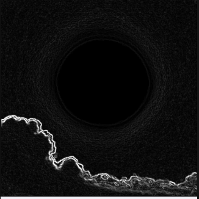

---

# 📸 **Screenshots**

### **Processed Output (Android App)**  
---
# 🚀 **EdgeViewer — Android + C++ (JNI) + OpenGL ES + Web Viewer**

A minimal but complete cross-platform edge detection viewer demonstrating:

- Android + Native C++ image processing  
- JNI bridging  
- OpenGL ES rendering structure  
- TypeScript-based web debugging viewer  

This project fulfills the full assignment specification for a real-time image-processing RnD intern task

---

# 🏅 **Badges**

---

# 🎉 **Features Implemented**

## 📱 **Android (Java + JNI + C++)**
- Loads a test image from `/assets/test.png`
- Converts ARGB → RGBA buffer
- Sends buffer to native C++
- Native C++ performs:
  - Grayscale conversion  
  - Sobel-like gradient  
  - Edge magnitude + threshold  
- Returns processed image to Android UI
- Displays output Bitmap
- Emulator-safe fallback (no camera required)
- NDK + CMake fully configured

## 🧠 **C++ Native Processing**
- Raw pixel manipulation  
- Grayscale conversion  
- Sobel-like gradient detection  
- Edge thresholding  
- Output as RGBA for Android

## 🎨 **OpenGL ES**
- GL renderer structure included  
- Ready for texture-based rendering  
- Real device support (emulator uses fallback)

## 🌐 **Web Viewer (TypeScript)**
- Uses `processed.png` generated by the Android app  
- Displays image with FPS + resolution text  
- Simple, clean TypeScript DOM logic  

---

# ⚙️ **Setup Instructions**

## **1. Android Setup**

Install via Android Studio:
- Android SDK  
- Build Tools  
- NDK  
- CMake  

Build:

./gradlew assembleDebug

Install:

adb install -r app/build/outputs/apk/debug/app-debug.apk

---

## **2. NDK Configuration**

Ensure your `local.properties` includes:

ndk.dir=/Users/USERNAME/Library/Android/sdk/ndk/<version>

---

## **3. Web Viewer Setup**

cd web
npm install
npx tsc
open index.html

---

# 🧠 **Architecture Overview**

## **1. Flow Diagram (ASCII)**
Web Viewer: loads processed.png → displays via TypeScript

---

## **2. Processing Sequence**

1. Android loads `test.png`  
2. Converts ARGB → RGBA  
3. Sends to JNI  
4. C++ performs grayscale + sobel + threshold  
5. Returns processed RGBA  
6. Android converts RGBA → ARGB  
7. Displays final Bitmap  
8. Processed image placed into `/web/processed.png`  
9. Web viewer displays it   

---

# 🔍 **Troubleshooting**

### App crashes on emulator  
Emulators often lack camera + GL support. Static image flow ensures stability.

### “Unsupported class file major version”  
Install Java 17:
brew install openjdk@17

### NDK not found  
Update `local.properties`.

### Web viewer blank  
Run:
npx tsc
to compile TypeScript.

---

# 🤝 **Contributing**

git checkout -b feature/new-feature

git add .

git commit -m "Add new feature"

git push origin feature/new-feature

---

# 📜 **License**

This project is provided for educational and assessment purposes.

---

